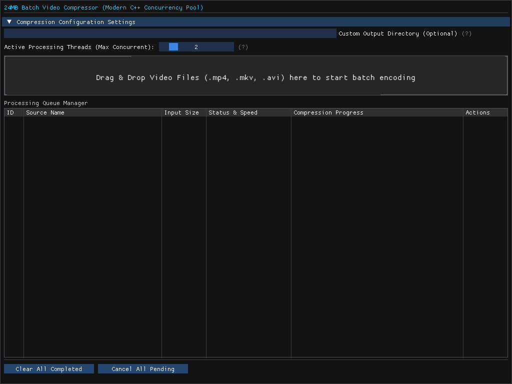
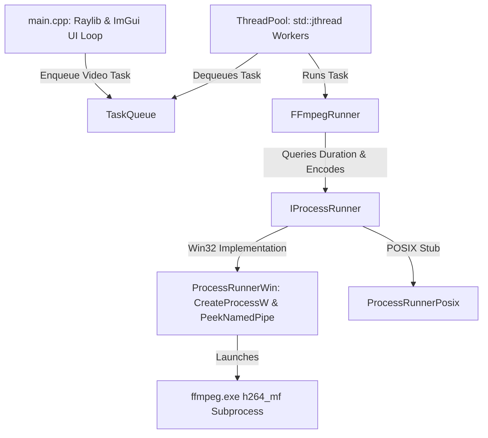

# TargetSize Video Compressor

TargetSize Video Compressor is a high-performance, multithreaded desktop application designed to batch-compress video files to exact target sizes matching social media limits (e.g., Discord's 24 MB free limit, WhatsApp, Telegram, and custom sizes). 

Built with **C++23**, **Raylib**, **Dear ImGui**, and **FFmpeg**, the application utilizes hardware-accelerated encoders (Windows Media Foundation `h264_mf`) to compress videos swiftly while ensuring the output remains strictly within target boundaries.

---

## 📸 Interface Preview



---

## 🚀 Key Features

* **Social Media Upload Presets**: Pre-configured target boundaries tailored for popular platforms:
  * **Discord**: 10 MB (Free limit) / 24 MB (Classic limit - optimized to prevent metadata overflow) / 100 MB (Nitro)
  * **WhatsApp**: 16 MB (Standard Video) / 100 MB (HD Document limit)
  * **Telegram**: 50 MB (Standard limit)
  * **X / Twitter**: 512 MB (Free limit)
* **Dynamic Custom Slider**: Toggle to specify a exact custom limit from `1.0 MB` up to `1000.0 MB`.
* **Hardware Accelerated single-pass H.264**: Leverages GPU-accelerated Intel/NVIDIA/AMD codecs on Windows (`h264_mf`) for fast encoding times and minimal CPU usage.
* **Multithreaded Worker Pool**: Configurable worker threads (from 1 to 8) dynamically executing parallel encoding tasks.
* **Non-Blocking Subprocess Execution**: Communicates with FFmpeg subprocesses using non-blocking pipes to display real-time FPS and progress updates without locking the UI.
* **User Experience Enhancements**: Native file and directory chooser dialogs, custom output path persistence, drag-and-drop support, and one-click playback of completed videos.

---

## 📥 Download & Run (No Installation Required)

You do not need to build the application from source. You can download the latest pre-compiled version directly from GitHub:

1. **Download:** Go to the [Releases page](https://github.com/sedatsan/TargetSize-Video-Compressor/releases) and download the latest `TargetSize-Video-Compressor-v*.zip` file.
2. **Extract:** Extract the `.zip` archive to any folder on your computer. 
3. **Run:** Double-click on `targetsize-video-compressor.exe` to launch the application.

*Note: The required FFmpeg components are bundled within the `.zip`, so no external dependencies or installations are necessary.*

---

## 🛠️ Architecture and Engineering Highlights

While the application is optimized specifically for the Windows ecosystem (due to hardware-accelerated Media Foundation `h264_mf` encoding), the project's codebase layout is architecturally decoupled—isolating platform-specific features behind abstract interfaces to support future cross-platform development.



### 1. Architectural Decoupling (Windows & POSIX Stubs)
Windows COM and process management headers often pollute global symbol namespaces (clashing with graphic symbols like Raylib's `CloseWindow`). To resolve this, all platform-dependent behaviors are hidden behind clean interfaces:
* **[IProcessRunner](include/ProcessRunner.hpp)**: Handles non-blocking execution of FFmpeg subprocesses. Conditionally compiles [ProcessRunnerWin.cpp](src/ProcessRunnerWin.cpp) on Windows and [ProcessRunnerPosix.cpp](src/ProcessRunnerPosix.cpp) (stub) on macOS/Linux.
* **[dialogs.hpp](include/dialogs.hpp)**: Standard C++ interfaces for settings storage, folder dialogs, and native default player launching.

---

## ⚡ Performance Benchmarks

Below is quantified telemetry comparing the hardware-accelerated Windows Media Foundation (`h264_mf`) encoder against standard CPU encoding (`libx264` - medium preset). 

### Benchmark Environment:
* **Test Video:** 1080p @ 30 FPS (30 seconds, 900 frames total)
* **Processor:** Multithreaded CPU (24 logical cores)
* **GPU:** Hardware-accelerated encoder

### Results:
| Metric | GPU (`h264_mf`) | CPU (`libx264` Medium) | GPU Benefit |
| :--- | :--- | :--- | :--- |
| **Total Encoding Time (Latency)** | **2.92 seconds** | 4.32 seconds | **1.48x Latency Reduction** |
| **Throughput (FPS)** | **308.23 FPS** | 208.30 FPS | **148% Speedup** |
| **CPU Utilization** | **< 5%** (mostly idle) | ~90%+ (all cores busy) | **~95% CPU Load Offloaded** |

*Note: GPU encoding offloads the intensive compression math to the dedicated ASIC chip on the graphics card, preventing the system from freezing or lagging during heavy video tasks and allowing smooth multitasking (such as gaming) during batch processes.*

### 2. Non-blocking Pipe Reading
To update video compression progress in real-time, the application needs to read `stderr` from FFmpeg. Using standard blocking reads (`ReadFile` or `std::getline`) blocks the calling thread, preventing cancellation checks and smooth updates. 
[ProcessRunnerWin](src/ProcessRunnerWin.cpp) implements asynchronous-like polling using the Win32 `PeekNamedPipe` API to query buffer sizes prior to reading:
```cpp
// Non-blocking check for available data in the pipe
if (!PeekNamedPipe(hReadPipe, nullptr, 0, nullptr, &bytesAvail, nullptr) || bytesAvail == 0) {
    return false; // Yield execution instead of blocking the worker thread
}
```

### 3. Dynamic Bitrate Calculation
Calculating the ideal bitrate for a single-pass constraint requires parsing the video duration first, then allocating a safety boundary:
$$\text{Total Bitrate (bps)} = \frac{(\text{Target Size (MB)} - \text{Buffer (MB)}) \times 1024 \times 1024 \times 8}{\text{Duration (seconds)}}$$
The video bitrate is calculated by subtracting `128kbps` for the audio stream, while falling back to a minimum video floor of `100kbps` for long videos.

---

## 📂 Codebase Layout

```
targetsize-video-compressor/
├── .github/workflows/   # CI/CD pipelines
│   └── build.yml        # Windows Build pipeline (Ninja + vcpkg cache)
├── assets/              # Interface screenshots
├── include/             # Header files (declarations)
│   ├── ProcessRunner.hpp# Abstract process wrapper interface
│   ├── FFmpegRunner.hpp # Video duration querying & compression wrapper
│   ├── ThreadPool.hpp   # Concurrency worker threads (jthread-based)
│   ├── TaskQueue.hpp    # Synchronized job dispatch queue
│   ├── TaskStatus.hpp   # Structural task metadata
│   └── dialogs.hpp      # Non-UI Win32 folder selectors & launch tools
└── src/                 # Implementations
    ├── main.cpp         # Raylib runtime and ImGui dashboard
    ├── ProcessRunnerWin.cpp # Win32 CreateProcess wrapper
    ├── ProcessRunnerPosix.cpp # POSIX shell execution stubs
    ├── FFmpegRunner.cpp # Command formulation and progress tracking
    ├── ThreadPool.cpp   # Worker thread lifecycle loops
    ├── TaskQueue.cpp    # Thread-safe operations queue
    ├── dialogs_win.cpp  # Win32 COM folder select & shell execute
    └── dialogs_stub.cpp # Cross-platform stubs
```

---

## 🔧 Building from Source

### Prerequisites
1. **Visual Studio 2022** with the **Desktop development with C++** workload.
2. **vcpkg** installed on your system.
3. **CMake** (v3.25 or higher) and **Ninja** build tools.

### Build Steps
1. **Clone the repository**:
   ```bash
   git clone https://github.com/sedatsan/TargetSize-Video-Compressor.git
   cd TargetSize-Video-Compressor
   ```
2. **Configure with CMake Presets**:
   Set `VCPKG_ROOT` in your environment (or pass it as an argument). Visual Studio will automatically detect the configuration preset `x64-release`:
   ```bash
   cmake --preset x64-release "-DCMAKE_TOOLCHAIN_FILE=%VCPKG_ROOT%/scripts/buildsystems/vcpkg.cmake"
   ```
3. **Build the Release binary**:
   ```bash
   cmake --build out/build/x64-release --config Release
   ```
   The compiled executable will be located in `out/build/x64-release/targetsize-video-compressor.exe`.

---

## 🛸 CI/CD Workflow
The project contains a GitHub Actions build pipeline in [.github/workflows/build.yml](.github/workflows/build.yml). On every push or pull request to the `main` branch, the pipeline:
1. Provisions a `windows-latest` VM runner.
2. Configures the developer toolchain and compilers.
3. Leverages GitHub Cache to restore compiled `vcpkg` package archives, reducing dependencies build time.
4. Generates and compiles the production `Release` build using CMake and Ninja.
5. Executes an **Automated Functional Test** via a hidden headless CLI mode to mathematically guarantee the executable works before release.
6. Archives the binary alongside necessary FFmpeg DLLs into a `.zip` and publishes it to the GitHub Releases page.

---

## 📄 License
This project is open-source and licensed under the [MIT License](LICENSE).
